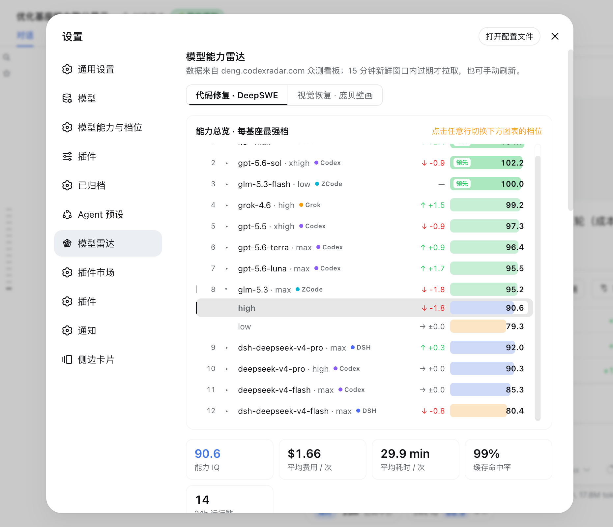
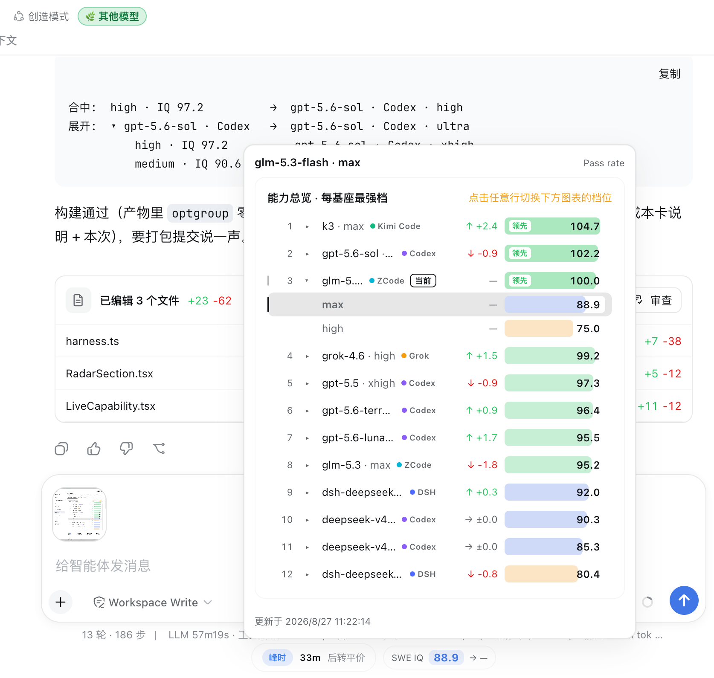

# dsh-models-radar

<h1 align="center">dsh-models-radar · 模型能力雷达</h1>

<p align="center"><b>把 deng.codexradar.com 的众测能力分装进 DeepSeek Harness：总览、趋势、成本，一屏读完。</b></p>

<p align="center">
  <a href="./README.md">English</a> ·
  <a href="#使用方法">使用方法</a> ·
  <a href="#数据与隐私">数据与隐私</a> ·
  <a href="#故障排查">故障排查</a>
</p>

<p align="center">
  <a href="https://github.com/hi-fangj/dsh-models-radar/stargazers"></a>
  <a href="LICENSE"></a>
  
  
</p>

面向 [DeepSeek Harness](https://github.com/deepseek-ai/DeepSeek-Harness) Web GUI 的模型能力雷达插件。插件读取 [deng.codexradar.com](https://deng.codexradar.com) 的公开众测数据，在设置页增加「模型雷达」页面，并在输入框工具行内（模型选择器左侧）显示当前 session 所选模型的 DeepSWE 实时能力读数。

## 截图预览

**设置页 · 能力总览** — 每基座最强档排行，行内标注分数出处 Harness（Codex / DSH / ZCode / Grok / Kimi Code / Antigravity / CodeBuddy），点击任意行切换下方图表的档位。



**能力浮层** — 点击输入框旁的能力读数展开：跨基座对比选型 + 当前档位详情，「当前」标记实时跟随会话模型。



## 亮点

- **分数出处一眼可辨。** 每个基座行内都带 Harness 徽章（Codex / DSH / ZCode / Grok / Kimi Code / Antigravity / CodeBuddy，站点同款配色），档位选择器的选项同样写全「模型 · 力度 · Harness」；识别不了的基座不打标，绝不猜测。
- **每基座最强档排行。** 能力总览按基座聚合，行内嵌固定 `0–110` 绝对刻度的量级条与 24h 趋势信号，展开可查看该基座全部推理力度档位。
- **24h / 7d 双窗 IQ 趋势。** 页签切换两个时间窗，各自独立缩放与统计（区间变化、最低、平均、最高）；曲线按能力等级分段着色。
- **成本 × IQ 三视角对比。** 综合成本（站点同款「2.5 倍价格可换 1.35 倍速度」折算公式，图内归一化）、时间成本、费用成本页签切换；颜色＝基座、形状＝推理力度，同基座档位以折线相连，越靠左上越高效。悬停读数与站点同构三行：归属（展示名 · 计费 · Harness · 力度）、IQ（通过/总数）、当前指标与样本数。
- **社区体感分。** codexradar.com 主站社区按近 7 天 / 近 24 小时滚动窗打出的 0–10 体验评分柱状图：按基座分组、组内按推理力度排列，柱色＝基座，当前选中档位高亮（近似命中带 ≈），无人评分的档位以「未评分」占位；双窗独立计新鲜窗口，全局数据、与评测频道无关。
- **输入框旁实时读数。** 通过 DSH 官方 per-session 模型目录精确匹配 `model@reasoningEffort`，会话切换模型立即更新；点击展开能力浮层做跨基座对比选型。
- **轻量、零凭据、可离线。** 浏览器不直连上游（Host 同源代理），按类别新鲜窗口刷新、窗口内零上游请求；上游不可用时自动回退本地快照；不请求任何凭据、不提交任何数据。

## 功能

- 通过 `settings.section` 扩展点增加 **设置 → 模型雷达** 页面
- 通过 `settings.plugin.item` 扩展点增加 **设置 → 插件 → 可配置插件** 的「模型雷达」卡片（显示会话能力浮窗开关，偏好存 Host 设置）
- **能力总览**：按基座模型聚合，可展开查看所有推理力度档位，行内 Harness 徽章标注分数出处
- 使用固定 `0–110` IQ 刻度，跨频道保持一致的能力等级语义
- **IQ 趋势页签**：近 24 小时 / 近 7 天切换，各窗独立 y 轴缩放与完整统计，选择被记住
- **成本 × IQ 对比卡**：综合 / 时间 / 费用三个页签，对数横轴，模型 chip 行多选筛选，Codex 跑的 DSV4 两档默认隐藏（与站点一致）
- **社区体感分卡**：近 7 天 / 近 24 小时页签（选择被记住），两窗槽位一致、独立 15 分钟新鲜窗口；仅设置页，不进浮层
- 支持两个评测频道：
  - `deep-swe`：代码修复任务，binary-majority 多数票评分
  - `pompeii-adjacency`：视觉恢复任务，连续 Adjacency F1 评分
- 语义化任务诊断：
  - DeepSWE：通过 / 投票分歧 / 失败
  - Pompeii：较低 / 一般 / 良好 / 优秀
  - 待关注任务优先排序与本地筛选
  - 任务标题点击直达源仓库（DeepSWE 为 GitHub 项目），标题后带站点同款编程语言徽章（Py/JS/TS/Go/Rust）
- 效率指标徽章：IQ、平均费用、平均耗时、缓存命中率、24h 运行数
- **能力浮层**：从输入框旁读数展开，总览对比选型 + 查看档位完整详情（徽章、双窗趋势、任务构成）
- 按类别新鲜窗口刷新：总览/任务构成 15 分钟、频道列表/趋势/任务源信息 60 分钟；只重拉过期数据，窗口内零上游请求（单飞行合并）
- 页脚常驻**手动刷新**按钮（绕行窗口），旁边显示最近拉取时间
- 上游不可用时自动使用最近一次本地快照
- 中英文 UI 文案

## 环境要求

- DeepSeek Harness Web GUI
- `dsh-super-injector`，用于运行时注入或持久安装本地插件
- Node.js 22 或更高版本
- npm

## 安装

### 从 Git 直接安装

最简单的安装方式是直接将 GitHub 仓库加入 `web` profile：

```bash
dsh plugin --profile web add github:hi-fangj/dsh-models-radar
```

也可以使用完整 Git URL：

```bash
dsh plugin --profile web add git+https://github.com/hi-fangj/dsh-models-radar.git
```

仓库已包含 DSH 所需的 Host 和浏览器构建产物，因此从 Git 直接安装不需要执行 dependency lifecycle script，也不需要配置 pnpm build allowlist。安装后刷新 `http://127.0.0.1:3080`；如果当前进程没有自动热加载新包，请重启一次 DSH。

移除通过 Git 安装的插件：

```bash
dsh plugin --profile web remove dsh-models-radar
```

### 从本地源码安装

需要开发或修改插件时，手动克隆并构建：

```bash
git clone https://github.com/hi-fangj/dsh-models-radar.git
cd dsh-models-radar
npm ci
npm run build
```

构建产物：

- `lib/index.js`：Host ESM bundle
- `lib/client.js`：带 DSH `ModuleLoader` 握手的浏览器 CJS bundle

构建完成后，将本地插件包加入 `web` profile：

```bash
dsh plugin --profile web add /插件绝对路径/dsh-models-radar
```

`dsh plugin` 会把依赖安装操作交给指定 profile，因此该命令会把插件安装到 `~/.dsh/profiles/web`。仓库已包含从 Git 安装所需的构建产物；修改本地源码后，需要先执行 `npm run build`，再添加或重载该本地 clone。

安装后刷新 `http://127.0.0.1:3080`。如果当前运行的 DSH 进程没有自动热加载新包，请重启一次 DSH，然后刷新页面。

移除通过 CLI 安装的依赖：

```bash
dsh plugin --profile web remove dsh-models-radar
```

移除后重启 DSH，使 profile 在不包含该插件的情况下重新装配。

### 运行时注入与持久安装

运行时注入适合快速试用。在 DSH 会话中让 Agent 调用：

```text
dev_inject_plugin({
  "dir": "/插件绝对路径/dsh-models-radar"
})
```

随后刷新一次 `http://127.0.0.1:3080`。运行时注入会保持到 DSH 进程重启，或主动卸载插件为止。

如需写入 `web` profile 的依赖和 bundle 列表，让 Agent 调用：

```text
dev_install_package({
  "dir": "/插件绝对路径/dsh-models-radar",
  "profile": "web"
})
```

安装后刷新 Web GUI。DSH 重启时会再次从 profile 装配该插件。

## 使用方法

### 模型雷达页面

1. 打开 DSH Web GUI 左下角的**设置**。
2. 选择**模型雷达**。
3. 在页面顶部选择 `DeepSWE` 或 `庞贝壁画` 频道。
4. 从能力总览或档位选择器中选择模型档位。

页面每次打开都会在新鲜窗口内刷新：缓存中的数据不发上游请求，仅过期数据集被重拉。点击总览中的任意行，会同步切换下方效率指标、趋势图和任务诊断所使用的档位。

### 能力总览

默认每个基座模型显示当前最强档位；展开一行可查看该基座全部推理力度。IQ 进度条使用固定 `0–110` 绝对刻度：

| IQ | 能力等级 |
| --- | --- |
| `< 70` | 待提升 |
| `70–84.9` | 一般 |
| `85–94.9` | 稳健 |
| `95–99.9` | 优秀 |
| `≥ 100` | 领先 |

### IQ 趋势

近 24 小时与近 7 天两个页签来自同一份小时级序列的时间窗切片，各窗独立缩放 y 轴，各带一组完整统计（区间变化、最低、平均、最高）。曲线按能力等级分段着色，面积填充与曲线同色；端点与悬停标记使用所在等级的颜色。

### 成本 × IQ 对比

三个页签（综合成本 / 时间成本 / 费用成本）分别以对数成本轴 × 线性 IQ 轴绘制全部档位：颜色＝基座（站点同款配色）、形状＝推理力度（off=× · low=○ · medium=△ · high=□ · xhigh=◇ · max=⬡ · ultra=★），同基座档位按力度顺序以折线相连。**越靠左上越高效。** 模型 chip 行可多选筛选，同步作用于当前页签；Codex 跑的 DSV4 两档默认隐藏，与站点行为一致。

### 任务诊断

DeepSWE 使用上游真实的多数票判定；Pompeii 保留连续 F1 语义。筛选、计数和排序全部在浏览器本地完成，切换筛选不会增加 API 请求。

任务标题与语言徽章来自站点的任务目录（`/table` 端点，60 分钟窗口，经 Host 代理只截取 tasks 数组）：标题在有源仓库时是外链（DeepSWE 为 GitHub 项目、Pompeii 为数据集页），徽章按站点词表显示 Py/JS/TS/Go/Rust，未知语言原样展示。目录拉取失败只丢徽章与链接，不影响频道视图。

### 能力浮层

点击输入框工具行里的能力读数展开浮层：顶部为全基座能力总览（供对比选型），其下为查看档位的完整详情（效率徽章、双窗 IQ 趋势、任务构成）。查看档位默认跟随会话模型；点击总览行或切换趋势卡档位下拉可临时查看其他档位，会话切换模型或浮层关闭后回到跟随。

### 输入框能力读数

紧凑读数（`SWE IQ` 标签 + 档位色分数药丸）读取的是当前 session **下一次请求**选中的模型，而不是仅根据最近一次已完成回复推测。显示形式：

```text
SWE IQ 90.2
```

匹配顺序：

1. 精确匹配 `model@reasoningEffort`
2. 匹配同一基座模型的最高 IQ 档位，并在分数前显示 `≈`
3. DeepSWE 榜单中完全没有该基座时隐藏胶囊

在 composer 中切换模型后，胶囊立即更新。读数每 15 分钟（最短新鲜窗口）向 Host 轮询一次，每次仅一次本地请求、每频道每窗口至多一次上游拉取；刷新失败时保留最近一次成功值。

不想在输入框旁看到胶囊？**设置 → 插件 → 可配置插件** 里的「模型雷达」卡片提供「显示会话能力浮窗」开关，可整体隐藏它；关闭期间胶囊不渲染、也不再后台轮询。偏好持久化在 Host 设置（跨浏览器共享、清浏览器缓存不丢失；升级前存在 localStorage 的旧选择会被一次性迁移）。

## 更新

```bash
cd /插件绝对路径/dsh-models-radar
git pull
npm ci
npm run build
```

运行时注入的插件可让 Agent 热重载：

```text
dev_reload_package({
  "packageName": "dsh-models-radar"
})
```

如果 client 依赖图发生变化，请刷新页面。

## 卸载

卸载运行时注入的插件：

```text
dev_uninject_plugin({
  "match": "dsh-models-radar"
})
```

持久安装的插件请通过 profile/plugin manager 移除 `dsh-models-radar`，然后重启 DSH。快照历史会保留在 `~/.dsh/plugin-data/dsh-models-radar/`；仅在确认不再需要历史时单独删除该目录。

## 数据与隐私

插件读取 `https://api.codexradar.com/api/v1` 的公开免认证接口：

- `/benchmarks`
- `/intelligence-efficiency`
- `/iq-history`
- `/leaderboard`

浏览器不会直接访问上游 API。由于 `api.codexradar.com` 使用浏览器 Origin 白名单，Host 半通过同源接口 `/model-radar/api/data` 代理请求。设计原因见 [ADR-0001](docs/adr/0001-host-proxy-fetch.md)。

本插件：

- 不请求密码、Token 或其他凭据
- 不提交评测结果
- 不发送会话内容
- 本地只保存公开评测数据快照

快照目录：

```text
~/.dsh/plugin-data/dsh-models-radar/
├── latest-deep-swe.json
├── latest-pompeii-adjacency.json
└── iq-timeline.jsonl
```

## 架构

```text
Browser
  ├── settings.section → 模型雷达页面
  ├── settings.plugin.item → 插件配置卡片（显示会话能力浮窗开关）
  ├── conversation.composer.dock → 当前 session 能力胶囊 + 能力浮层
  ├── GET /model-radar/api/data
  └── GET/POST /model-radar/api/pref
            │
            ▼
Host plugin
  ├── 各数据集独立新鲜窗口（效率/任务构成 15 分钟，频道列表/趋势 60 分钟）
  ├── 单飞行上游请求 + 频道全局 benchmarks 缓存
  ├── 归一化为 RadarView
  ├── settings namespace dsh-models-radar（会话能力浮窗偏好，持久化到 Host 设置）
  └── 本地快照持久化（重启后在窗口内继续服务快照）
```

能力胶囊订阅 DSH 官方 `modelDirectories` per-session store，因此模型选择变化不需要轮询即可传播。

## 开发

```bash
npm ci
npm run build
```

GitHub Actions 在每次 push/PR 时做构建验证；推送 `v*` tag 则自动构建、打包并发布带 tgz 附件的 GitHub Release。发版流程：

```bash
# 修改 package.json 版本并提交后：
git tag v0.1.x
git push origin main --tags
```

常用 DSH 开发操作：

```text
dev_inject_plugin({ "dir": "/插件绝对路径/dsh-models-radar" })
dev_reload_package({ "packageName": "dsh-models-radar" })
dev_uninject_plugin({ "match": "dsh-models-radar" })
```

主要源码：

- `src/index.ts`：Host 代理、刷新节流、快照
- `src/client/RadarSection.tsx`：设置页状态与界面组合
- `src/client/Overview.tsx`：能力总览
- `src/client/charts.tsx`：趋势图和任务诊断
- `src/client/costScatter.tsx`：成本 × IQ 对比散点
- `src/client/harness.ts`：Harness 归属推导与档位选择器文案
- `src/client/LiveCapability.tsx`：输入框工具行实时能力读数与浮层
- `src/client/ScrollFrame.tsx`：溢出列表滚动条
- `src/client/scoreMetrics.ts`：IQ 等级和趋势语义
- `CONTEXT.md`：项目领域词汇

## 文档

| 文档 | 内容 |
| --- | --- |
| [ADR-0001](docs/adr/0001-host-proxy-fetch.md) | 为什么浏览器不直连上游、由 Host 同源代理 |
| [ADR-0002](docs/adr/0002-freshness-window.md) | 按类别新鲜窗口的刷新节流设计 |
| [CONTEXT.md](CONTEXT.md) | 项目领域词汇表（模型档位、Harness、趋势等） |

## 故障排查

### 设置页没有「模型雷达」tab

1. 确认 `npm run build` 已生成 `lib/client.js`。
2. 使用 `dev_plugin_status` 确认插件处于 active 状态。
3. 刷新一次 Web GUI，加载最新 client 依赖图。

### 输入框里没有能力读数

- 确认当前模型存在于 DeepSWE 榜单。
- 同基座 fallback 会显示 `≈`；完全未知的基座按设计不显示。
- 确认官方模型选择 UI 插件已启用。

### 上游刷新失败

存在历史快照时，设置页会显示最近一次成功数据。请检查 `api.codexradar.com` 的网络连通性；该接口不需要凭据。

## 许可证

[MIT](LICENSE)
